# Entity relationship model

FleetOS has 51 tables. This document gives the shape of the model: the central
tenant boundary, the major entity groups, and a relationship catalogue with
cardinality and rationale. The authoritative source is
`apps/api/prisma/schema.prisma`.

## The tenant boundary

`Company` is the tenant root. Almost every other table carries `company_id` and
is isolated by row-level security (see [security-model.md](./security-model.md)).
`User` is deliberately **not** company-scoped: a user is a global identity that
can belong to several companies through `CompanyMembership` — the model that
makes FleetOS genuinely multi-company rather than one-account-per-company.

## Core ERD

```mermaid
erDiagram
    Company ||--o{ CompanyMembership : "has members"
    Company ||--o{ Role : "defines"
    User ||--o{ CompanyMembership : "belongs via"
    Role ||--o{ CompanyMembership : "assigned to"
    Role ||--o{ RolePermission : "grants"
    Permission ||--o{ RolePermission : "granted by"

    Company ||--o{ Asset : "owns"
    AssetClass ||--o{ Asset : "classifies"
    Company ||--o{ Operator : "employs"
    Operator |o--o| User : "may log in as"
    FatigueRuleSet ||--o{ Operator : "governs"
    Asset ||--o{ AttachedUnit : "hitches"
    Asset ||--o{ GpsDevice : "tracked by"
    GpsDevice ||--o{ GpsPing : "emits"

    Company ||--o{ Job : "dispatches"
    Asset ||--o{ Job : "assigned to"
    Operator ||--o{ Job : "driven by"
    Depot ||--o{ Job : "picks up from"
    Job ||--o{ JobStop : "contains"
    Customer ||--o{ JobStop : "delivered to"
    JobStop ||--o{ StopParcel : "carries"
    JobStop ||--o| Attachment : "POD / signature"

    Asset ||--o{ MaintenanceJob : "services"
    MaintenanceJob ||--o{ MaintenanceJobPartUsage : "consumes"
    Part ||--o{ MaintenanceJobPartUsage : "used in"
    MaintenanceScheduleTemplate ||--o{ AssetMaintenancePlan : "deploys as"
    Asset ||--o{ AssetMaintenancePlan : "scheduled by"

    Asset ||--o{ ComplianceDocument : "certified by"
    Operator ||--o{ ComplianceDocument : "certified by"
    ComplianceDocument ||--o| Attachment : "scan"
    Company ||--o{ Document : "file library"
    Document ||--o| Attachment : "bytes"

    ChecklistTemplate ||--o{ ChecklistSubmission : "completed as"
    Asset ||--o{ ChecklistSubmission : "inspected in"
    Operator ||--o{ ChecklistSubmission : "submitted by"
    FormTemplate ||--o{ FormSubmission : "completed as"

    Company ||--o{ TimelineEvent : "history"
    Company ||--o{ AuditLog : "security trail"
    Company ||--o{ Notification : "notifies"
    User ||--o{ Notification : "recipient"
```

*(The diagram shows the load-bearing relationships; peripheral tables —
warehouse machines, knowledge articles, address books, dashboard/notification
presets, scheduler leases — follow the same `Company ||--o{ …` tenant pattern.)*

## Relationship catalogue

### Identity & access (Part 6)
| Relationship | Cardinality | Why |
|---|---|---|
| Company → CompanyMembership → User | M:N via join | A user can work for multiple companies; a company has many users. The membership carries the per-company role. |
| Role → RolePermission → Permission | M:N via join | Roles are bundles of granular permissions; permissions are a shared global catalogue. |
| CompanyMembership → Role | N:1 | Each membership is granted exactly one role within that company. |
| User → AuthToken | 1:N | Password-reset / email-verify tokens, keyed to the user, single-use. |
| User → PushSubscription | 1:N | A user may register several devices for Web Push. |

### Fleet & assets (Part 7)
| Relationship | Cardinality | Why |
|---|---|---|
| AssetClass → Asset | 1:N | Land/Air/Sea plus tenant-defined categories classify each asset. |
| Asset → AttachedUnit | 1:N | Trailers/attachments hitch to a prime mover; the hitch/unhitch history is retained (never overwritten) so past couplings resolve. |
| Asset ↔ Asset via GraphRelationship | M:N | The fleet graph models arbitrary asset-to-asset relationships (e.g. shared attached units) for intelligence features. |
| Operator ⇄ User | 0..1:0..1 | A driver profile *may* be linked to a login identity (DriverOS), but an operator can exist without a login and a user without an operator profile. |
| Asset → GpsDevice → GpsPing | 1:N → 1:N | A tracker is bound to an asset and emits a breadcrumb history; the current position is cached on the device/operator for the live map. |

Asset **lifecycle** (Created → Active → Inactive → Retired → Disposed) and
**assignment history** are modelled as time-stamped Timeline events and archival
(`archived_at`), never by overwriting a status in place — so "who had this asset
on 05/06/2026" is always answerable.

### Dispatch & delivery (Parts 7, 9)
| Relationship | Cardinality | Why |
|---|---|---|
| Job → JobStop | 1:N | A multi-stop run; stop order and outcome are per-stop. |
| JobStop → StopParcel | 1:N | Multiple parcels per stop, individually barcode-scannable. |
| JobStop → Customer / Depot | N:1 | Deliveries resolve to saved customer addresses; pickups to depots. |
| JobStop → Attachment (POD, signature) | N:0..1 | Proof-of-delivery photo and captured signature. |
| JobStop → JobStop (reattempt_of) | self, N:0..1 | A failed delivery's reattempt links back to the original, preserving the failure history. |

### Maintenance (Part 8)
| Relationship | Cardinality | Why |
|---|---|---|
| Asset → MaintenanceJob | 1:N | Full service history per asset — what, when, who, cost, evidence, next-service. |
| MaintenanceJob → MaintenanceJobPartUsage → Part | M:N via join | Which parts, how many, at what cost, were consumed in a service. |
| MaintenanceScheduleTemplate → AssetMaintenancePlan → Asset | template deployed per asset | Savable/deployable schedules; a template deployed to many assets, each plan tracking its own next-due. |

### Compliance & documents (Part 10)
| Relationship | Cardinality | Why |
|---|---|---|
| Asset / Operator → ComplianceDocument | 1:N | Registration, insurance, roadworthy, licences — with expiry tracking and alerts. |
| ComplianceDocument / Document → Attachment | N:0..1 | The stored file bytes (inline or S3), shared attachment model. |
| Company → Document | 1:N | The company file library with categories and expiry. |

### Inspections & forms (Part 9)
| Relationship | Cardinality | Why |
|---|---|---|
| ChecklistTemplate → ChecklistSubmission | 1:N | Templates are tenant-defined dynamic forms; submissions are the completed responses (answers in JSONB), never hard-coded questions. |
| ChecklistBundle → ChecklistBundleItem → ChecklistTemplate | M:N via join | Deployable inspection bundles applied to an asset class. |
| FormTemplate → FormSubmission | 1:N | The generic Universal Forms engine, same dynamic-form pattern. |

### Cross-cutting (Part 11)
| Relationship | Cardinality | Why |
|---|---|---|
| Company → TimelineEvent | 1:N | Every entity has a business-history timeline (`entity_type` + `entity_id`, polymorphic within the tenant). |
| Company → AuditLog | 1:N | The append-only security/access trail (who did what) — see [security-model.md](./security-model.md). |
| Company/User → Notification | 1:N | In-app + digest notifications, per recipient, with per-type mute preferences. |
